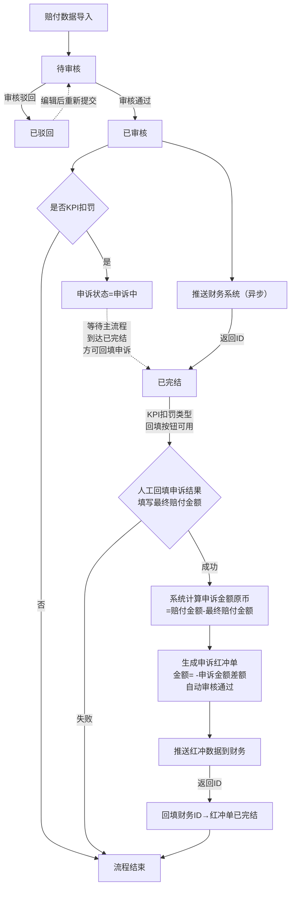
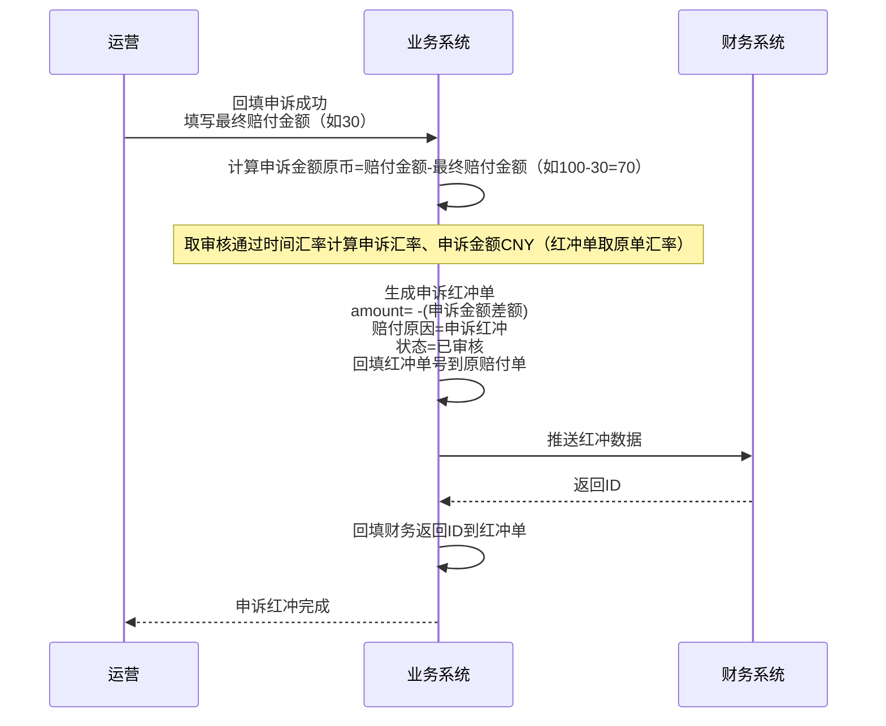
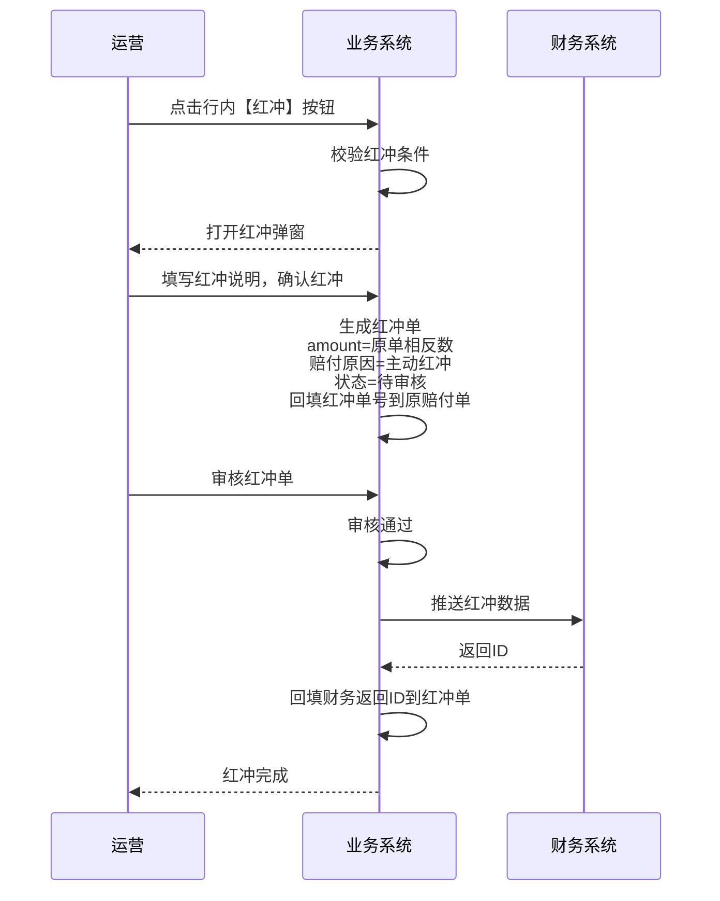

# 客户赔付流程

> **文档说明**：涵盖客户赔付的全流程（含客户赔付-主流程、客户赔付-平台扣罚两个子场景），包括正向流程、KPI扣罚申诉分支和逆向红冲流程
> **适用范围**：小包业务客户赔付

---

## 一、流程概述

### 1.1 适用场景

| 业务类型     | 场景说明                                        | 数据维度 |
| ------------ | ----------------------------------------------- | -------- |
| **客户赔付** | 赔付给客户的业务场景，包括异常赔付和KPI扣罚类型 | 订单维度 |

### 1.2 流程特点

- **类型判断**：系统根据赔付类型字段自动判断流程分支
- **财务先行**：审核通过后先推送财务系统，返回ID后主流程达已完结，KPI扣罚类型方可回填申诉
- **申诉自动**：KPI扣罚类型自动进入申诉流程，人工回填最终赔付金额
- **申诉红冲**：申诉成功时系统按差额（计算规则：申诉金额 = 赔付金额 - 最终赔付金额）自动生成红冲单，无需全额红冲
- **申诉处理**：回填申诉后系统计算申诉金额、汇率及CNY，完成后自动触发申诉红冲

## 二、正向流程

### 2.1 流程图



### 2.2 流程步骤说明

| 步骤 | 步骤名称     | 操作人   | 动作                       | 系统处理                                                                                                                                |
| ---- | ------------ | -------- | -------------------------- | --------------------------------------------------------------------------------------------------------------------------------------- |
| 1    | 数据导入     | 客服     | 导入赔付数据               | 系统通过处理号拉取产品代码、客户代码等已有数据                                                                                          |
| 2    | 待审核       | 运营     | 审核赔付单                 | 校验数据完整性、金额合理性                                                                                                              |
| 3    | 已审核       | 运营     | 确认审核通过               | 记录审核时间、审核人；同时触发两个异步分支（以下 4-5 与 6 并行执行）                                                                    |
| 4    | 推送财务     | 系统自动 | 推送赔付数据到财务         | 等待财务系统返回ID                                                                                                                      |
| 5    | 记录财务ID   | 系统自动 | 接收财务返回ID             | 记录财务返回ID到赔付单，状态更新为【已完结】                                                                                            |
| 6    | 申诉标记     | 系统自动 | 判断是否为KPI扣罚          | 审核通过后，KPI扣罚类型标记申诉状态为【申诉中】（申诉回填需等待赔付状态=已完结后方可用）；异常赔付类型无申诉状态                        |
| 7    | 回填申诉     | 运营     | 人工回填最终赔付金额       | 回填申诉结果及最终赔付金额原币；计算申诉金额原币=赔付金额-最终赔付金额，取审核通过时间汇率计算申诉汇率、申诉金额CNY，自动生成申诉红冲单（红冲单汇率复制原单（原赔付单）汇率（申诉红冲场景下该值即原单的申诉汇率）） |
| 8    | 申诉红冲生成 | 系统自动 | 申诉成功自动生成申诉红冲单 | 生成红冲单，赔付金额= -申诉金额原币（非原单全额）；**同时立即回填红冲单号到原赔付单**；红冲单自动审核通过并推送财务                     |
| 9    | 推送红冲财务 | 系统自动 | 推送红冲数据到财务         | 等待财务返回ID，回填财务ID，红冲单状态变为【已完结】                                                                                    |
| 10   | 流程完成     | -        | -                          | 原赔付单已标记红冲单号，红冲单财务已归档                                                                                                |

### 2.3 关键状态说明

#### 2.3.1 主流程状态

| 状态   | 说明                 |
| ------ | -------------------- |
| 待审核 | 数据已导入，等待审核 |
| 已驳回 | 审核未通过，驳回修改 |
| 已审核 | 审核通过             |
| 已完结 | 流程结束，数据归档   |

#### 2.3.2 申诉流程状态（仅KPI扣罚类型）

| 状态     | 说明                     |
| -------- | ------------------------ |
| 申诉中   | KPI扣罚类型等待申诉结果  |
| 申诉成功 | 申诉成功，生成申诉红冲单 |
| 申诉失败 | 申诉失败，流程结束       |

## 三、申诉金额与申诉红冲（差额计算）

### 申诉红冲示例

| 步骤     | 操作               | 金额变化               | 说明               |
| -------- | ------------------ | ---------------------- | ------------------ |
| ①        | 导入赔付单         | 赔付金额=USD 100       | 记录初始赔付判定   |
| ②        | 审核通过→推送财务  | 财务扣款USD 100        | -                  |
| ③        | 回填申诉（成功）   | 最终赔付金额=USD 30    | 业务确定实际只赔30 |
| ④        | 系统计算           | 申诉金额=100-30=USD 70 | 系统自动完成       |
| ⑤        | 自动生成申诉红冲单 | 红冲金额= -USD 70      | 推财务冲回70       |
| **最终** | 公司实际承担       | 最终赔付=USD 30        | -                  |

---

## 四、逆向流程（红冲）

### 4.1 红冲场景

| 红冲类型     | 触发方式 | 触发条件                     | 审核方式     |
| ------------ | -------- | ---------------------------- | ------------ |
| **申诉红冲** | 系统自动 | KPI扣罚申诉成功时自动生成    | 自动审核通过 |
| **主动红冲** | 人工单条 | 运营点击行内【红冲】按钮发起 | 需人工审核   |

**主动红冲适用场景**：

- 导入数据错误（金额、币种、处理号等录入错误）
- 财务已同步后发现数据有误
- 业务取消赔付决定
- 其他需要冲抵原赔付单的场景

### 4.2 红冲流程

#### 4.2.1 申诉红冲流程

> **核心逻辑**：申诉红冲的金额 = 赔付金额 - 最终赔付金额（差额），而非全额红冲



#### 4.2.2 主动红冲流程



### 4.3 红冲规则

#### 4.3.1 通用规则

- **红冲单号**：回填红冲单的ID（如 `PYC20260608000002`），红冲单的处理号与原单一致
- **红冲金额**：
  - **主动红冲**：与原单金额相反（全额对冲）
  - **申诉红冲**：与原单金额的差额（赔付金额 - 最终赔付金额），而非全额
- **回填时机**：生成红冲单时立即回填红冲单号到原赔付单（不管审核状态）
- **财务处理**：红冲单审核通过后推送财务系统，返回ID后回填

#### 4.3.2 主动红冲前置条件

```sql
-- 能否发起红冲
WHERE 单据类型 != '红冲赔付'
  AND 赔付状态 = '已完结'
  AND 红冲单号 IS NULL
  AND NOT (赔付类型 = 'KPI扣罚' AND 申诉状态 != '申诉失败')  //即：KPI扣罚类型的仅申诉失败 时才允许主动红冲
```

| 条件                | 说明                                       |
| ------------------- | ------------------------------------------ |
| **红冲单号为空**    | 已红冲的单据不可再次红冲                   |
| **状态限制**        | 仅【已完结】状态可发起红冲                 |
| **单据类型限制**    | 红冲赔付单本身不能再被红冲                 |
| **KPI扣罚特殊判断** | KPI扣罚类型需申诉状态=申诉失败才能主动红冲 |

**错误提示**：

- 红冲单号不为空："该赔付单已存在红冲记录，请勿重复红冲"
- KPI扣罚且申诉中："KPI扣罚类型需申诉失败后才能主动红冲"
- KPI扣罚且申诉成功："申诉成功的KPI扣罚单已自动红冲，请勿重复操作"
- 红冲赔付单："红冲单本身不能再被红冲"

#### 4.3.3 红冲单状态流转

红冲单作为特殊类型的赔付单，复用赔付单状态机，各状态下的系统动作如下：

| 红冲单状态 | 触发条件           | 系统动作                                               |
| ---------- | ------------------ | ------------------------------------------------------ |
| **待审核** | 主动红冲生成时     | 回填红冲单号到原赔付单                                 |
| **已审核** | 审核通过           | 推送财务系统，返回财务ID后回填；红冲单状态流转至已完结 |
| **已驳回** | 审核驳回           | 原赔付单红冲单号保留，需删除红冲单后才能重新发起       |
| **已完结** | 已审核且财务返回ID | 红冲流程结束，数据归档                                 |

```
待审核 → 已审核 → 已完结
    ↓
  已驳回
```

#### 4.3.4 红冲单删除规则

| 状态       | 是否可删除 | 删除后系统动作                                 |
| ---------- | ---------- | ---------------------------------------------- |
| **待审核** | 可删除     | 清空原赔付单的红冲单号字段，原单可重新发起红冲 |
| **已驳回** | 可删除     | 清空原赔付单的红冲单号字段，原单可重新发起红冲 |
| **已审核** | 不可删除   | -                                              |
| **已完结** | 不可删除   | -                                              |

### 4.4 重新赔付

红冲完成后，如仍需赔付：

1. 用户可**重新导入/录入**赔付数据
2. 处理号使用**原处理号**（OMS订单号不变）
3. 赔付原因可与原单相同（因原单已红冲，红冲单号有值，导入校验通过）
4. 新赔付单与原红冲单无关联，走正常审核流程
5. 新赔付单生成**新的系统ID**（系统自增主键）

---

## 五、单据关联关系

| 单据           | 来源              | 关联单据 | 用途                                                               | 审核方式                           |
| -------------- | ----------------- | -------- | ------------------------------------------------------------------ | ---------------------------------- |
| **客户赔付单** | 外部导入/系统生成 | 订单     | 正向赔付数据                                                       | 人工审核                           |
| **红冲单**     | 系统生成          | 原赔付单 | 冲抵原赔付（主动红冲全额冲抵，申诉红冲差额冲抵，详见四、逆向流程） | 申诉红冲自动审核，主动红冲人工审核 |

---

## 六、流程边界

- 不跟踪客户实际结算状态（因客户账单走线下）
- 不管理客户收款确认
- 不触发供应商索赔，索赔由运营人员独立发起
