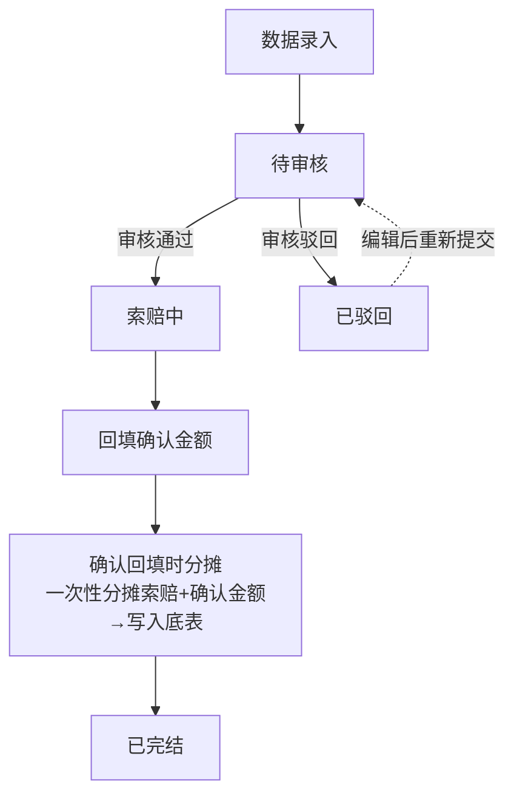
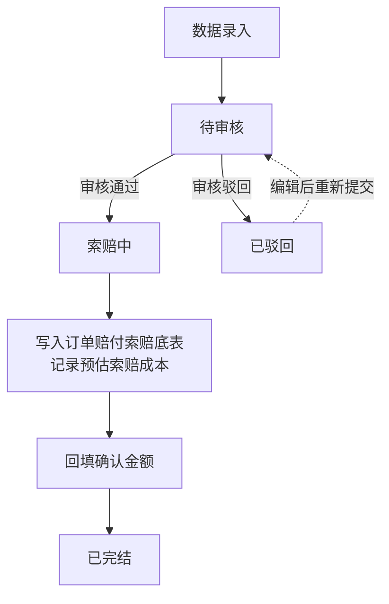
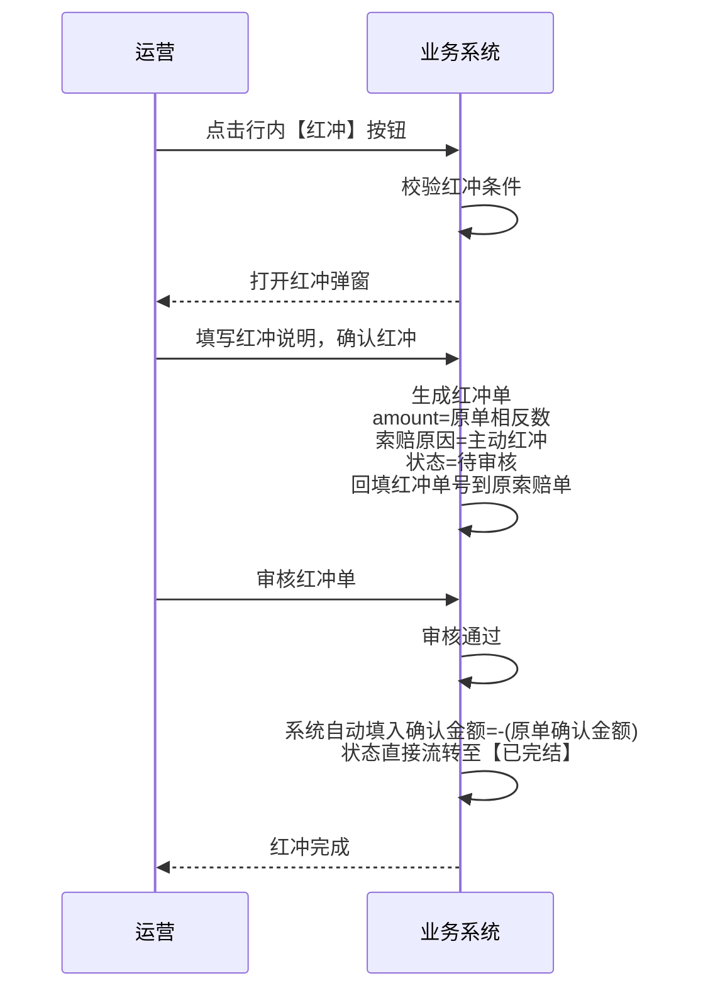

# 供应商索赔流程

## 一、流程概述

### 1.1 适用场景

| 业务类型              | 场景说明                            | 数据维度               | 处理方式               |
| --------------------- | ----------------------------------- | ---------------------- | ---------------------- |
| **小包业务-干线索赔** | 干线（A/B/C段）运输环节向承运商索赔 | 运单/箱子/订单三维可选 | 按计费重占比分摊       |
| **小包业务-尾程索赔** | 尾程（D段）派送环节向尾程供应商索赔 | 订单维度               | 直接关联订单，无需分摊 |

### 1.2 核心特点

- **多维度录入**：干线支持运单/箱子/订单三种维度，尾程仅订单维度
- **统一底表**：分摊结果统一写入「订单赔付索赔底表」，干线+尾程各段在订单维度对齐（分摊规则详见二、三）
- **流程边界**：
  - 索赔与客户赔付无联动，由运营人员独立发起
  - 不跟踪供应商实际结算状态
  - 不管理供应商收款确认
  - 不支持 KPI 扣罚及申诉流程（仅客户赔付有此功能）

## 二、干线流程（干线索赔）

### 2.1 流程图



### 2.2 录入维度

| 录入维度     | 适用场景             | 录入方式          | 分摊范围           |
| ------------ | -------------------- | ----------------- | ------------------ |
| **运单维度** | 承运商按整单运输索赔 | 录入运单号        | 运单下全部订单     |
| **箱子维度** | 承运商按某些箱子索赔 | 录入运单号+箱号   | 指定箱子下全部订单 |
| **订单维度** | 承运商按特定订单索赔 | 录入运单号+处理号 | 指定订单           |

> **校验规则**：箱子必须属于该运单，订单必须属于该运单（或箱子）

### 2.3 分摊规则

**核心原则**：按计费重占比分摊，分摊范围由录入维度决定

| 录入维度 | 分摊基数                 | 分摊公式                                                       |
| -------- | ------------------------ | -------------------------------------------------------------- |
| 运单维度 | 运单下全部订单计费重合计 | 订单分摊金额 = 索赔金额 ×（该订单计费重 / 运单计费重合计）     |
| 箱子维度 | 箱子下全部订单计费重合计 | 订单分摊金额 = 索赔金额 ×（该订单计费重 / 箱子计费重合计）     |
| 订单维度 | 选中订单计费重合计       | 订单分摊金额 = 索赔金额 ×（该订单计费重 / 选中订单计费重合计） |

#### 2.3.1 货币精度处理规则

**原币金额分摊**：按索赔原币的国际标准精度四舍五入保留最终结果。

- 人民币（CNY）：保留2位小数
- 日元（JPY）：保留0位小数（无小数位）
- 欧元（EUR）：保留2位小数
- 美元（USD）：保留2位小数

**转换后CNY金额分摊**：当索赔原币为非CNY币种时，先将原币金额按汇率转换为CNY，再乘以分摊系数，结果保留4位小数精度，用于财务核算的精确计算。

**特殊说明**：若索赔原币本身为CNY，则按原币规则保留2位小数，无需额外转换。

**技术实现说明**：上述货币精度标准来源于ISO 4217国际标准，操作系统（如Windows、macOS、Linux）已内置全球各国货币的标准格式，系统可通过区域设置（Locale）API自动获取对应精度，无需手动维护货币精度映射表。

### 2.4 分摊示例

**场景**：运单WY001（提单号：BL001）下索赔A段金额¥1,000

| 运单号   | 处理号 | 计费重(kg) | 计费重占比 | A段索赔分摊 |
| -------- | ------ | ---------- | ---------- | ----------- |
| WY001    | OD001  | 2.5        | 25%        | ¥250        |
| WY001    | OD002  | 4.0        | 40%        | ¥400        |
| WY001    | OD003  | 3.5        | 35%        | ¥350        |
| **合计** | -      | **10.0**   | **100%**   | **¥1,000**  |

---

## 三、尾程流程（尾程索赔）

### 3.1 流程图



### 3.2 与干线的核心差异

| 维度         | 干线                   | 尾程                   |
| ------------ | ---------------------- | ---------------------- |
| **数据维度** | 运单/箱子/订单三维可选 | 订单维度（一对一）     |
| **分摊机制** | 按计费重占比分摊       | 无需分摊，直接写入底表 |
| **写入时机** | 确认回填后触发分摊     | 确认回填后写入         |

---

## 四、流程步骤与状态总览

### 4.1 流程步骤

索赔数据在**确认回填后**直接完结，本系统内结束流程，不再推送外部系统。

| 阶段 | 步骤 | 状态   | 触发条件     | 系统动作                                                 |
| ---- | ---- | ------ | ------------ | -------------------------------------------------------- |
| 录入 | -    | 待审核 | 提交索赔单   | 校验数据，拉取订单及计费重信息                           |
| 审核 | 1    | 索赔中 | 审核通过     | 记录索赔金额（底表于确认回填后写入，详见执行步骤） |
| 审核 | -    | 已驳回 | 审核驳回     | 退回录入环节，编辑后重新提交                             |
| 执行 | 2    | 索赔中 | 回填确认金额 | 记录确认金额信息，状态直接变更为【已完结】；**干线**→触发分摊（按最新计费重占比一次性分摊索赔金额与确认金额，写入底表），**尾程**→写入底表（索赔金额CNY+确认金额CNY），刷新索赔确认差异CNY |
| 逆向 | -    | 已完结 | 主动红冲     | 生成红冲单，回填红冲单号（详见五、逆向流程） |

---

## 五、逆向流程（红冲）

### 5.1 红冲场景

| 红冲类型     | 触发方式 | 触发条件                     | 审核方式   |
| ------------ | -------- | ---------------------------- | ---------- |
| **主动红冲** | 人工单条 | 运营点击行内【红冲】按钮发起 | 需人工审核 |

**主动红冲适用场景**：

- 导入数据错误（金额、币种、运单号等录入错误）
- 业务取消索赔决定
- 其他需要冲抵原索赔单的场景

### 5.2 主动红冲流程



### 5.3 红冲规则

**通用规则**：
- **红冲单号**：回填红冲单的ID（如 `CLA20260608000002`/`CLD20260608000002`），红冲单的运单号/处理号与原单一致
- **红冲金额**：与原单金额相反（对冲关系）
- **回填时机**：生成红冲单时立即回填红冲单号到原索赔单（不管审核状态）
- **汇率**：红冲单的索赔汇率/确认汇率复制原索赔单汇率，确保红冲CNY = -原单CNY，与原单精确对冲（与客户赔付红冲口径一致）

**主动红冲前置条件**：

```sql
-- 能否发起红冲（按判断优先级排序）
WHERE 单据类型 != '红冲索赔'
  AND 红冲单号 IS NULL
  AND 索赔状态 = '已完结'
```

| 条件             | 说明                       |
| ---------------- | -------------------------- |
| **单据类型限制** | 红冲索赔单据不可再次红冲   |
| **红冲单号为空** | 已红冲的单据不可再次红冲   |
| **状态限制**     | 仅【已完结】状态可发起红冲 |

错误提示（按判断顺序）：单据类型不符→"红冲索赔单据不可再次红冲"；红冲单号不为空→"该索赔单已存在红冲记录"；索赔状态不符→"仅已完结的索赔单可发起红冲"

**红冲单生命周期**：

| 红冲单状态 | 触发条件           | 系统动作                               | 可否删除 | 删除后动作                             |
| ---------- | ------------------ | -------------------------------------- | -------- | -------------------------------------- |
| **待审核** | 主动红冲生成时     | 回填红冲单号到原索赔单                 | 可删除   | 清空原索赔单的红冲单号，可重新发起红冲 |
| **索赔中** | 审核通过           | 系统自动填入确认金额=-(原单确认金额)，确认汇率同步复制原单确认汇率；**干线**→复制原单分摊明细逐行取负写入底表（不再重新分摊），**尾程**→复制原单索赔记录逐行取负写入底表（不再重新分摊）；状态直接流转至【已完结】 | 不可删除 | - |
| **已驳回** | 审核驳回           | 原索赔单红冲单号保留                   | 可删除   | 清空原索赔单的红冲单号，可重新发起红冲 |
| **已完结** | 审核通过后 | 红冲流程结束，数据归档                 | 不可删除 | -                                      |

状态机：

```
待审核 → 索赔中 → 已完结
    ↓
  已驳回
```

### 5.4 重新索赔

红冲完成后，如仍需索赔：

1. 用户可**重新录入**索赔数据
2. 使用**原运单号/处理号**
3. 新索赔单与原红冲单无关联，走正常审核流程
4. 新索赔单生成**新的系统ID**


