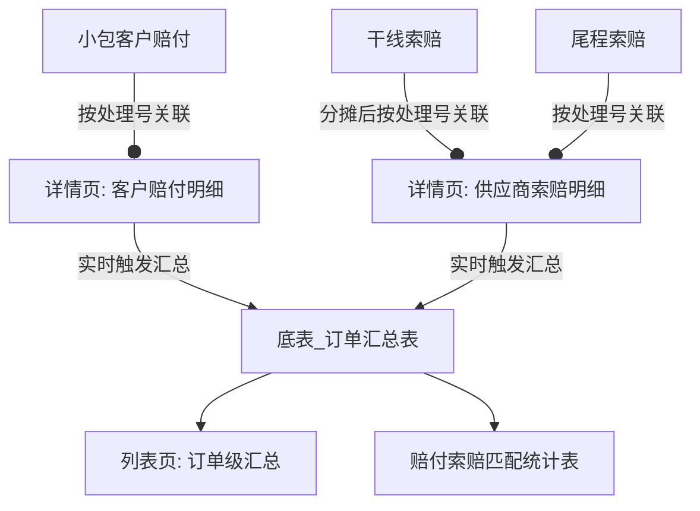

# 订单赔付索赔底表

## 一、页面概述

### 1.1 页面定位

订单赔付索赔底表是业务全局赔付数据一体化管理的核心汇总页面，以处理号为唯一维度，汇总展示该处理号在客户赔付和供应商索赔两个方向的全量数据，支持从处理号视角查看完整的赔付索赔生命周期。

### 1.2 数据来源

| 源表         | 数据类型                | 数据维度                   | 写入时机       |
| ------------ | ----------------------- | -------------------------- | -------------- |
| 小包客户赔付 | 客户赔付数据            | 处理号维度                | 实时写入       |
| 干线索赔     | 供应商索赔数据（ABC段） | 运单维度，分摊后按处理号写入 | 分摊完成后写入 |
| 尾程索赔     | 供应商索赔数据（D段）   | 处理号维度                | 实时写入       |

### 1.3 数据关系

### 1.4 数据结构概要

本 PRD 定义以下数据结构：

| 数据对象               | 存储要求            | 唯一键          | 说明                                                                                                       |
| ---------------------- | ------------------- | --------------- | ---------------------------------------------------------------------------------------------------------- |
| **底表\_订单汇总表**   | **必须为物理表** ✅ | 处理号          | 处理号级汇总数据，供列表页展示和统计报表直接查询。此表必须保证查询性能，支持实时更新                         |
| **客户赔付明细视图**   | IT自定              | 赔付单号        | 按处理号展示客户赔付明细，数据来源于小包客户赔付表。存储方式（物理表/视图/直连源表）由 IT 确定             |
| **供应商索赔明细视图** | IT自定              | 索赔单号+处理号 | 按处理号展示供应商索赔明细（含干线和尾程），数据来源于干线索赔表（分摊后）和尾程索赔表。存储方式由 IT 确定 |

> **说明**：
>
> - **底表\_订单汇总表** 必须是物理表，是因为"赔付索赔匹配统计表"需要直接基于该表做 `GROUP BY 匹配状态` 统计，且列表页需高性能查询
> - 两种明细数据只要求详情页能按处理号展示相应明细字段即可，**具体存储实现（独立物理表、统一存储、或直接查询源表）由 IT 自行决定**

---

## 二、列表页设计

### 2.1 页面布局

- **顶部**：筛选条件区 + 导出按钮
- **中部**：数据表格，处理号可点击跳转详情页
- **底部**：分页器

### 2.2 字段详情

> **存储说明**：以下所有字段均存储在 **底表\_订单汇总表**（物理表）中；当明细数据变更时，系统重新计算汇总值并实时更新该表。

| 序号 | 字段名称          | 字段来源       | 字段逻辑                                                | 列表展示 | 可筛选   | 字段说明                             | 示例                |
| ---- | ----------------- | -------------- | ------------------------------------------------------- | -------- | -------- | ------------------------------------ | ------------------- |
| 1    | 处理号            | OMS订单        | 唯一键值，关联OMS订单表                                 | 是       | 批量查询 | 内部唯一键值                         | WNBAA0465333013YQ   |
| 2    | 客户代码          | OMS订单        | 根据处理号取OMS客户代码                                 | 是       | 是       | 客户唯一标识                         | WNB989820           |
| 3    | 客单号            | OMS订单        | 根据处理号取OMS客单号                                   | 是       | 是       | 客户订单号                           | XM1YE49206188       |
| 4    | 跟踪号            | OMS订单        | 根据处理号取OMS跟踪号                                   | 是       | 是       | 物流跟踪号码                         | H048SA0084680981    |
| 5    | 目的国            | OMS订单        | 根据处理号取OMS目的国                                   | 是       | 是       | 目的地国家                           | GB                  |
| 6    | 渠道代码          | OMS订单        | 根据处理号取OMS物流服务                                 | 是       | 是       | 物流渠道代码                         | HERMESUK_ND_DIRECT  |
| 7    | 产品代码          | OMS订单        | 根据处理号取OMS物流产品                                 | 是       | 是       | 产品代码                             | WBUKPEXPEC          |
| 8    | 提单号            | OMS订单        | 根据处理号取OMS提单号                                   | 是       | 是       | 提单号                               | 860-12345678        |
| 9    | 箱号              | OMS订单        | 根据处理号取OMS箱号                                     | 是       | 是       | 箱号                                 | SZCWC26052800486    |
| 10   | 赔付次数          | 系统计算后存储 | 该处理号的客户赔付明细笔数                                | 是       | 否       | 含所有状态和红冲数据                 | 3                   |
| 11   | 赔付金额CNY       | 系统计算后存储 | 所有赔付明细的赔付金额CNY汇总                           | 是       | 否       | 含红冲数据（红冲为负值）             | CNY 500.00          |
| 12   | 索赔次数          | 系统计算后存储 | 该处理号的供应商索赔明细笔数                              | 是       | 否       | 含所有状态和红冲数据                 | 2                   |
| 13   | 索赔金额CNY       | 系统计算后存储 | 所有索赔明细的索赔金额CNY汇总                           | 是       | 否       | 含红冲数据（红冲为负值）             | CNY 800.00          |
| 14   | 确认金额CNY       | 系统计算后存储 | 所有索赔明细的确认金额CNY汇总                           | 是       | 否       | 含红冲数据                           | CNY 600.00          |
| 15   | **申诉金额CNY**   | 系统计算后存储 | 所有赔付明细的申诉金额CNY汇总                           | 是       | 否       | 仅KPI扣罚类型有值                    | CNY 507.50          |
| 16   | 索赔确认差异CNY   | 系统计算后存储 | 索赔金额CNY - 确认金额CNY                               | 是       | 否       | 索赔与确认金额差额                   | CNY 200.00          |
| 17   | 赔付索赔差异CNY   | 系统计算后存储 | 赔付金额CNY - 确认金额CNY                               | 是       | 否       | 客户视角净损失/收益                  | CNY -100.00         |
| 18   | 扣费时间          | 财务系统       | 按处理号从财务系统获取扣费时间                          | 是       | 是       | 财务实际扣费时间                     | 2026-05-28 14:35:00 |
| 19   | 出库时间          | OMS订单        | 按处理号从OMS获取出库时间                               | 是       | 是       | 订单出库时间                         | 2026-05-20 10:00:00 |
| 20   | 匹配状态          | 系统计算后存储 | 根据赔付金额和索赔金额计算                              | 是       | 是       | 有赔付无索赔/有索赔无赔付/有赔付有索赔       | 有赔付无索赔        |

**匹配状态判断逻辑**：

| 匹配状态     | 判断条件                                          |
| ------------ | ------------------------------------------------- |
| 有赔付无索赔 | 赔付次数 > 0 AND 索赔次数 = 0                      |
| 有索赔无赔付 | 赔付次数 = 0 AND 索赔次数 > 0                      |
| 有赔付有索赔 | 赔付次数 > 0 AND 索赔次数 > 0（同时有赔付和索赔）   |

> **说明**：使用 **赔付次数 / 索赔次数** 而非金额判断，避免因红冲金额抵消导致 SUM = 0 时误判为"无赔付/无索赔"。

### 2.3 按钮与操作

| 按钮     | 功能说明         | 交互说明                                |
| -------- | ---------------- | --------------------------------------- |
| **导出** | 导出当前筛选结果 | 点击后下载Excel文件，包含列表页全部字段 |

### 2.4 行内操作

| 操作           | 说明                                     |
| -------------- | ---------------------------------------- |
| **处理号链接** | 点击跳转详情页，展示该处理号的赔付索赔明细 |

---

## 三、详情页设计

### 3.1 页面布局

详情页采用**上下分栏全部展开布局**：

- **上半部分**：订单基础信息
- **下半部分**：两个明细卡片依次平铺展示，无需Tab切换
  - 客户赔付明细
  - 供应商索赔明细

### 3.2 订单基础信息区

展示该订单的OMS基础信息：

| 分组     | 字段                                                                                                                    |
| -------- | ----------------------------------------------------------------------------------------------------------------------- |
| 订单信息 | 处理号、客户代码、客单号、跟踪号                                                                                        |
| 物流信息 | 目的国、渠道代码、产品代码、提单号、箱号                                                                                |
| 汇总信息 | 赔付次数、赔付金额CNY、索赔次数、索赔金额CNY、确认金额CNY、申诉金额CNY、索赔确认差异CNY、赔付索赔差异CNY |

### 3.3 客户赔付明细表

**数据来源**：小包客户赔付表，按处理号关联

| 序号 | 字段名称         | 字段来源                 | 说明               | 示例                |
| ---- | ---------------- | ------------------------ | ------------------ | ------------------- |
| 1    | 赔付单号         | 小包客户赔付.ID          | 系统生成的唯一编码 | PYC20260608000001   |
| 2    | 单据类型         | 小包客户赔付.单据类型    | 正常赔付/红冲赔付  | 正常赔付            |
| 3    | 赔付类型         | 小包客户赔付.赔付类型    | 异常赔付/KPI扣罚   | 异常赔付            |
| 4    | 赔付原因         | 小包客户赔付.赔付原因    | 赔付事由           | 尾程丢失            |
| 5    | 赔付币种         | 小包客户赔付.赔付币种    | 标准币种代码       | USD                 |
| 6    | 赔付金额（原币） | 小包客户赔付.赔付金额    | 原币金额           | 50.00               |
| 7    | 赔付汇率         | 小包客户赔付.赔付汇率    | 审核通过时汇率     | 7.2500              |
| 8    | 赔付金额CNY      | 小包客户赔付.赔付金额CNY | 人民币等值         | CNY 362.50          |
| 9    | 申诉金额原币     | 小包客户赔付.申诉金额原币 | 赔付金额-最终赔付金额，仅KPI扣罚类型有值 | USD 30.00           |
| 10   | 申诉汇率         | 小包客户赔付.申诉汇率     | 申诉审核通过时汇率 | 7.2500              |
| 11   | 申诉金额CNY      | 小包客户赔付.申诉金额CNY  | 申诉金额人民币等值 | CNY 217.50          |
| 12   | 创建时间         | 底表系统字段             | 该条数据创建时间   | 2026-05-28 10:00:00 |
| 13   | 最后更新时间     | 底表系统字段             | 该条数据更新时间   | 2026-05-28 14:30:00 |

### 3.4 供应商索赔明细表

> **数据来源**：干线索赔（分摊后）+ 尾程索赔，按处理号关联展示
> **存储方式**：由 IT 自行确定（可独立存储、统一存储或直连源表）

| 序号 | 字段名称         | 字段来源                          | 说明                       | 示例                                  |
| ---- | ---------------- | --------------------------------- | -------------------------- | ------------------------------------- |
| 1    | 索赔单号         | 干线索赔/尾程索赔.ID              | 系统生成的唯一编码         | CLA20260608000001 / CLD20260608000001 |
| 2    | 数据来源         | 系统计算                          | 标识来自干线还是尾程       | 干线/尾程                             |
| 3    | 分摊ID           | 干线索赔分摊明细.ID               | 干线分摊明细记录的唯一ID，格式 DA+YYYYMMDD+6位自增序号，尾程为空 | DA20260608000001                      |
| 4    | 单据类型         | 干线索赔/尾程索赔.单据类型        | 正常索赔/红冲索赔          | 正常索赔                              |
| 5    | 索赔类型         | 干线索赔/尾程索赔.索赔类型        | 异常索赔等                 | 异常索赔                              |
| 6    | 索赔原因         | 干线索赔/尾程索赔.索赔原因        | 索赔事由                   | 空运丢件                              |
| 7    | 运单号           | 干线索赔.运单号                   | 干线来源的运单号，尾程为空 | WY202605280001                        |
| 8    | 箱号             | 干线索赔分摊关联                  | 干线来源的箱号，尾程为空   | SZCWC26052800486                      |
| 9    | 索赔币种         | 干线索赔/尾程索赔.索赔币种        | 标准币种代码               | USD                                   |
| 10   | 索赔金额（原币） | 干线索赔/尾程索赔.索赔金额        | 原币金额                   | 500.00                                |
| 11   | 索赔汇率         | 干线索赔/尾程索赔.索赔汇率        | 审核通过时汇率             | 7.2500                                |
| 12   | 索赔金额CNY      | 干线索赔/尾程索赔.索赔金额CNY     | 人民币等值                 | CNY 3625.00                           |
| 13   | 确认币种         | 干线索赔/尾程索赔.确认币种        | 标准币种代码               | USD                                   |
| 14   | 确认金额（原币） | 干线索赔/尾程索赔.确认金额        | 原币金额（干线为分摊后值） | 480.00                                |
| 15   | 确认汇率         | 干线索赔/尾程索赔.确认汇率        | 审核通过时汇率             | 7.2500                                |
| 16   | 确认金额CNY      | 干线索赔/尾程索赔.确认金额CNY     | 人民币等值                 | CNY 3480.00                           |
| 17   | 索赔确认差异CNY  | 干线索赔/尾程索赔.索赔确认差异CNY | 索赔金额CNY-确认金额CNY    | CNY 145.00                            |
| 18   | 创建时间         | 底表系统字段                      | 该条数据创建时间           | 2026-05-28 10:00:00                   |
| 19   | 最后更新时间     | 底表系统字段                      | 该条数据更新时间           | 2026-05-28 14:30:00                   |

---

## 四、数据写入逻辑

### 4.1 底表\_订单汇总表写入规则

**底表\_订单汇总表** 是本 PRD 唯一要求物理存储的表，以 **处理号** 为唯一键。

#### 4.1.1 写入触发时机

| 写入目标                       | 数据来源           | 触发时机                                       | 写入内容                                         |
| ------------------------------ | ------------------ | ---------------------------------------------- | ------------------------------------------------ |
| **底表\_订单汇总表** ✅ 物理表 | 客户赔付明细数据   | **第一次**：赔付审核通过推送财务时触发         | 赔付金额CNY → 赔付金额CNY汇总                    |
| **底表\_订单汇总表** ✅ 物理表 | 客户赔付明细数据   | **第二次**：申诉金额计算完成后触发             | 申诉金额CNY → 申诉金额CNY汇总 |
| **底表\_订单汇总表** ✅ 物理表 | 供应商索赔明细数据 | 索赔明细新增/更新/删除时立即触发（干线/尾程均于确认回填后写入索赔金额CNY+确认金额CNY） | 订单级汇总字段 + 匹配状态 |
| **底表\_订单汇总表** ✅ 物理表 | 干线索赔（分摊）   | **分摊**：干线索赔确认回填后触发（按最新计费重占比一次性分摊索赔金额与确认金额） | 索赔金额CNY+确认金额CNY → 对应汇总；刷新索赔确认差异CNY |

#### 4.1.2 写入机制

1. 以 **处理号** 为唯一键，存在则更新，不存在则新增
2. 对受影响的处理号，重新计算所有汇总字段和匹配状态（计算逻辑详见 §4.4）
3. 订单维度基础信息（客户代码、目的国等）从 OMS 订单表关联获取

#### 4.1.3 查询用途

- 列表页：直接 SELECT \* FROM 底表\_订单汇总表
- 赔付索赔匹配统计表：直接 GROUP BY 匹配状态 统计
- 导出功能：直接导出 底表\_订单汇总表 数据

### 4.2 干线索赔分摊规则

干线索赔于确认回填时一次性分摊，影响底表汇总计算：

1. **分摊触发场景**
   - 确认回填后自动触发分摊（一次性分摊索赔金额与确认金额）
   - 手动点击"重新分摊"按钮触发重新分摊
   - 红冲索赔单审核通过后复制原单分摊明细（干线）/原单索赔记录（尾程）逐行取负写入（不再重新分摊）

2. **分摊比例一致性**
   - 确认金额与索赔金额使用同一次分摊计算的计费重占比，一次性写入
   - 重新分摊时，索赔金额和确认金额按新比例同步更新

3. **汇总影响**
   - 每次分摊完成后，按订单维度汇总索赔金额和确认金额
   - 计算结果同步更新 **底表\_订单汇总表**（§4.1）

### 4.3 其他数据规则

1. **红冲数据规则**
   - 红冲赔付：赔付金额CNY以负值参与汇总
   - 红冲索赔（尾程）：复制原单索赔记录逐行取负，索赔金额CNY以负值参与汇总（不再重新分摊）
   - 红冲索赔（干线）：审核通过后复制原单分摊明细逐行取负，以负值参与汇总（不再重新分摊）

### 4.4 汇总计算逻辑

> 以下计算结果 **写入底表\_订单汇总表** 的对应字段中存储。

| 汇总字段        | 计算逻辑                                                              |
| :-------------- | :-------------------------------------------------------------------- |
| 赔付次数        | COUNT(赔付明细)，含所有状态和红冲数据                                 |
| 赔付金额CNY     | SUM(赔付明细.赔付金额CNY)，红冲数据以负值参与计算                     |
| 索赔次数        | COUNT(索赔明细)，含所有状态和红冲数据                                 |
| 索赔金额CNY     | SUM(索赔明细.索赔金额CNY)，红冲数据以负值参与计算（含干线分摊后数据） |
| 确认金额CNY     | SUM(索赔明细.确认金额CNY)，含红冲数据                                 |
| 申诉金额CNY     | SUM(赔付明细.申诉金额CNY)，仅KPI扣罚类型有值                          |
| 索赔确认差异CNY | 索赔金额CNY - 确认金额CNY                                             |
| 赔付索赔差异CNY | 赔付金额CNY - 确认金额CNY                                             |
| 匹配状态        | 根据赔付次数和索赔次数判断（详见 §2.2）                               |

---

## 五、与源表字段对照

### 5.1 客户赔付明细字段对照

| 底表字段         | 小包客户赔付字段 | 说明         |
| ---------------- | ---------------- | ------------ |
| 赔付单号         | ID               | 直接映射     |
| 单据类型         | 单据类型         | 直接映射     |
| 赔付类型         | 赔付类型         | 直接映射     |
| 赔付原因         | 赔付原因         | 直接映射     |
| 赔付币种         | 赔付币种         | 直接映射     |
| 赔付金额（原币） | 赔付金额         | 解析原币金额 |
| 赔付汇率         | 赔付汇率         | 直接映射     |
| 赔付金额CNY      | 赔付金额CNY      | 直接映射     |
| 赔付状态         | 赔付状态         | 直接映射     |
| 审核人           | 审核人           | 直接映射     |
| 审核时间         | 审核时间         | 直接映射     |
| 审核意见         | 审核意见         | 直接映射     |
| 财务返回ID       | 财务返回ID       | 直接映射     |
| 完结时间         | 完结时间         | 直接映射     |
| 红冲单号         | 红冲单号         | 直接映射     |
| 创建人           | 创建人           | 直接映射     |
| 创建时间         | 创建时间         | 直接映射     |
| 备注             | 备注             | 直接映射     |
| 申诉金额原币     | 申诉金额原币     | 直接映射     |
| 申诉汇率         | 申诉汇率         | 直接映射     |
| 申诉金额CNY      | 申诉金额CNY      | 直接映射     |

### 5.2 供应商索赔明细字段对照

> 干线索赔 和 尾程索赔 均按处理号关联展示，部分字段因来源不同取值有差异：
| 底表字段         | 干线索赔字段    | 尾程索赔字段    | 说明                                                         |
| ---------------- | --------------- | --------------- | ------------------------------------------------------------ |
| 索赔单号         | ID              | ID              | 干线：分摊到订单维度后生成的订单级唯一ID；尾程：直接映射原ID |
| 数据来源         | 固定值"干线"    | 固定值"尾程"    | 系统标识                                                     |
| 单据类型         | 单据类型        | 单据类型        | 直接映射                                                     |
| 索赔类型         | 索赔类型        | 索赔类型        | 直接映射                                                     |
| 索赔原因         | 索赔原因        | 索赔原因        | 直接映射                                                     |
| 运单号           | 运单号          | 空值            | 仅干线有                                                     |
| 箱号             | 分摊关联的箱号  | 空值            | 仅干线有                                                     |
| 索赔币种         | 索赔币种        | 索赔币种        | 直接映射                                                     |
| 索赔金额（原币） | 索赔金额        | 索赔金额        | 解析原币金额                                                 |
| 索赔汇率         | 索赔汇率        | 索赔汇率        | 直接映射                                                     |
| 索赔金额CNY      | 索赔金额CNY     | 索赔金额CNY     | 直接映射                                                     |
| 确认币种         | 确认币种        | 确认币种        | 直接映射                                                     |
| 确认金额（原币） | 确认金额        | 确认金额        | 解析原币金额                                                 |
| 确认汇率         | 确认汇率        | 确认汇率        | 直接映射                                                     |
| 确认金额CNY      | 确认金额CNY     | 确认金额CNY     | 直接映射                                                     |
| 索赔确认差异CNY  | 索赔确认差异CNY | 索赔确认差异CNY | 直接映射                                                     |
| 索赔状态         | 索赔状态        | 索赔状态        | 直接映射                                                     |
| 审核人           | 审核人          | 审核人          | 直接映射                                                     |
| 审核时间         | 审核时间        | 审核时间        | 直接映射                                                     |
| 审核意见         | 审核意见        | 审核意见        | 直接映射                                                     |
| 确认人           | 确认人          | 确认人          | 直接映射                                                     |
| 确认备注         | 确认备注        | 确认备注        | 直接映射                                                     |
| 完结时间         | 完结时间        | 完结时间        | 直接映射                                                     |
| 红冲单号         | 红冲单号        | 红冲单号        | 直接映射                                                     |
| 创建人           | 创建人          | 创建人          | 直接映射                                                     |
| 创建时间         | 创建时间        | 创建时间        | 直接映射                                                     |
| 备注             | 备注            | 备注            | 直接映射                                                     |

---

## 六、与干线索赔、尾程索赔的核心差异

| 维度             | 干线索赔（ABC段）       | 尾程索赔（D段）         | 订单赔付索赔底表          |
| ---------------- | ----------------------- | ----------------------- | ------------------------- |
| **数据维度**     | 运单维度                | 订单维度                | 订单维度                  |
| **分摊机制**     | 需按计费重分摊至订单    | 无需分摊                | 直接聚合订单级数据        |
| **数据来源标识** | 明细表展示运单号、箱号  | 明细表无运单箱号        | 明细表标识"干线"/"尾程"   |
| **确认信息**     | 有确认金额、确认汇率等  | 有确认金额、确认汇率等  | 汇总展示确认数据          |
| **差异计算**     | 索赔金额CNY-确认金额CNY | 索赔金额CNY-确认金额CNY | 汇总差异+赔付索赔综合差异 |

---

## 七、特殊场景说明

### 7.1 红冲数据处理

- 红冲数据作为独立明细写入，单据类型标识为"红冲赔付"/"红冲索赔"
- 红冲金额的赔付金额CNY/索赔金额CNY以负值形式存储
- 汇总计算时直接参与SUM运算，实现净额展示

### 7.2 申诉数据处理（KPI扣罚类型）

- 小包客户赔付中的KPI扣罚类型申诉成功后，系统自动计算申诉金额（赔付金额 - 最终赔付金额）
- 申诉金额CNY作为独立字段写入底表（底表.申诉金额CNY）
- 同步生成申诉红冲单（金额 = -(申诉金额差额)），红冲数据以负值赔付金额参与赔付金额CNY汇总
- 底表同步触发第二次写入：更新申诉金额CNY汇总

### 7.3 干线索赔分摊数据

- 干线索赔仅于确认回填后触发一次分摊（一次性写入索赔金额与确认金额）
- 支持手动"重新分摊"按钮触发重新分摊，索赔金额和确认金额按新比例同步更新
- 红冲索赔单审核通过后复制原单分摊明细（干线）/原单索赔记录（尾程）逐行取负写入，不再重新分摊
- 分摊后的订单级索赔金额和确认金额作为明细数据，用于汇总计算 **底表\_订单汇总表**
- 不记录分摊比例和计算过程
- 明细中展示运单号和箱号，便于追溯数据来源

### 7.4 无赔付索赔数据的处理号

- 底表列表仅展示有赔付或索赔数据的处理号
- 纯OMS订单无赔付索赔记录的不在底表展示
