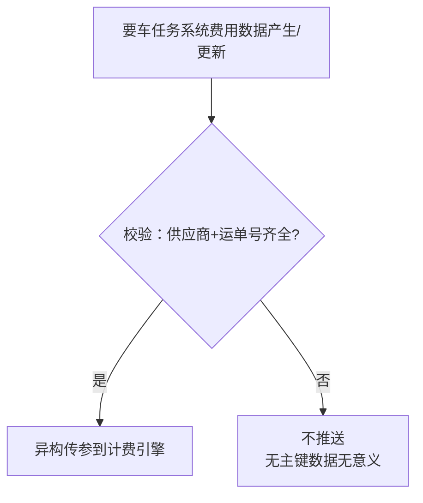

# A段成本自动化

> 本文档为A段（城际段）计算成本自动化需求的产品需求规格说明书（PRD）。

---

## 一、项目说明

### 1.1 项目背景

城际段运单计费依赖成本系统（COST）的城际转运报价。现状下，要车任务系统录入的费用信息需**人工查看→人工做成报价→人工导入成本系统**，存在效率低、易出错的问题。

本次需求旨在将"要车任务系统费用数据→报价生成→成本系统同步"链路自动化，由计费引擎统一管理报价、计费因子、费用项，实现要车任务系统数据自动推送到计费引擎，计费引擎同步到成本系统。

### 1.2 项目目标

- **自动化链路**：要车任务系统→计费引擎→成本系统（COST），替代现有人工做报价+人工导入cost
- **计费引擎统一管理**：报价、计费因子、费用项均在计费引擎统一管理
- **成本系统无需改造**：计费引擎同步cost沿用现成功能，cost仅做账单配置

### 1.3 项目范围

| 范围 | 说明 |
| --- | --- |
| 业务单据 | 运单（城际段） |
| 关联单据 | 要车任务（1:1） |
| 涉及系统 | TMS系统、要车任务系统、计费引擎、成本系统（COST） |
| 自动化目标 | 只做**按运单号维护的运单城际转运报价**，不做按时间段维护的报价 |

**项目负责范围**：
- 要车任务系统：费用产生数据/更新触发推送，按映射规则异构传参到计费引擎
- 计费引擎：接收结构化数据、新增费用项/计费因子管理、同步成本系统（现成功能）
- 成本系统（COST）侧配置：账单配置（数据字典映射+账单配置）

**项目不管范围**（沿用原逻辑）：
- 成本系统侧的报价表改造（无需改造）
- 成本系统侧的报价匹配与计费逻辑
- 运单计费参数为空或为0时的异常处理
- 成本系统重复导入的处理（本身有覆盖机制）
- 计费引擎同步成本系统的实现细节（现成功能）

> **关键结论**：本次项目做"要车任务系统→计费引擎"链路自动化+计费引擎新增费用项/CBM计费因子+成本系统账单配置，计费引擎同步成本系统沿用现成功能，成本系统计费沿用原逻辑。

### 1.4 术语表

| 术语 | 说明 |
| --- | --- |
| A段 | 城际段 |
| TMS系统 | 运单管理系统，提供运单数据（核重、CBM等） |
| 要车任务系统 | 城际段用车的任务单系统，录入费用信息；按映射规则异构传参到计费引擎 |
| 计费引擎 | 统一管理报价、计费因子、费用项的系统，只接收结构化数据 |
| 成本系统（COST） | 成本系统，负责运单计费 |
| 计费因子 | 计费依据，如核重、CBM等 |
| 新模板 | 参考其他成本段（空运卡转/国外清关/国外转运）的灵活报价格式 |

---

## 二、业务流程

### 2.1 现状流程（人工）

**现状痛点**：
- 人工查看录入信息→人工做成报价，效率低
- 人工导入成本系统，易出错
- 无自动化链路，依赖人工操作

### 2.2 目标流程（自动化）

### 2.3 流程对比

| 维度 | 现状（人工） | 目标（自动化） |
| --- | --- | --- |
| 触发 | 人工查看录入 | 费用产生数据即触发/有更新再次触发 |
| 数据结构化 | 人工做成报价 | 要车任务系统异构传参（按映射规则结构化） |
| 导入成本系统 | 人工导入 | 计费引擎同步成本系统（现成功能） |
| 费用项管理 | 成本系统固定列 | 计费引擎统一管理，新增费用项 |
| 因子管理 | 成本系统固定枚举 | 计费引擎统一管理，新增CBM计费因子 |

---

## 三、功能需求

### 3.1 要车任务系统侧

#### 3.1.1 数据要求

要车任务系统数据上必须包含以下字段，否则推送数据无意义（无主键）：

| 字段 | 必填 | 说明 |
| --- | --- | --- |
| 运单号 | 是 | 报价主键之一 |
| 供应商 | 是 | 报价主键之一 |
| 费用项 | 是 | 录入的费用项（10个枚举） |
| 计费方式 | 是 | 按车/按固定费/按重量/按方数 |
| 单价 | 是 | 单价或总价 |
| 最低收费 | 否 | 费用兜底值 |

#### 3.1.2 触发规则

| 触发场景 | 说明 |
| --- | --- |
| 费用产生数据 | 要车任务系统录入费用数据即触发推送 |
| 有更新 | 费用数据有更新必须再次触发推送 |

#### 3.1.3 推送前校验

**同步确认机制**：推送前校验供应商和运单号是否齐全，齐全才推，否则不推（无主键的数据无意义）。

#### 3.1.4 异构传参（数据结构化）

要车任务系统在推送前，按映射规则（详见第四章）将费用数据结构化为计费引擎需要的格式后传参，**计费引擎只接收结构化后的数据，不做转换**。

映射规则包括：
- 费用项映射：10个费用项→计费引擎A段城际转运的费用项
- 计费方式映射：4种计费方式→计费因子

### 3.2 计费引擎侧

#### 3.2.1 数据接收

计费引擎接收要车任务系统异构传参的结构化数据。

#### 3.2.2 新增费用项

在计费引擎新增7个费用项（要车任务系统有但成本系统现有没有的），计费引擎同步到成本系统：

| 费用项编码 | 费用项名称 | 费用项英文名称 | 费用项描述 | 单据类型 | 一级费用类型 | 二级费用类型 | 一级业务 | 二级业务 | 三级业务 | 状态 |
| --- | --- | --- | --- | --- | --- | --- | --- | --- | --- | --- |
| MultiplePickupCharge | 多点提货费 | MultiplePickupCharge |  | 运单 | 主运费 | 国内转运 | 小包全段 | A段 | 国内转运 | 启用 |
| MultipleUnloadingCharge | 多点卸货费 | MultipleUnloadingCharge |  | 运单 | 主运费 | 国内转运 | 小包全段 | A段 | 国内转运 | 启用 |
| OvertimeCharge | 超时费 | OvertimeCharge |  | 运单 | 主运费 | 国内转运 | 小包全段 | A段 | 国内转运 | 启用 |
| File | 文件费 | File |  | 运单 | 主运费 | 国内转运 | 小包全段 | A段 | 国内转运 | 启用 |
| CarpoolPickupCharge | 提货费（拼车） | CarpoolPickupCharge |  | 运单 | 主运费 | 国内转运 | 小包全段 | A段 | 国内转运 | 启用 |
| CarpoolDeliveryCharge | 送货费（拼车） | CarpoolDeliveryCharge |  | 运单 | 主运费 | 国内转运 | 小包全段 | A段 | 国内转运 | 启用 |
| ActualCostCharge | 实报实销费用 | ActualCostCharge |  | 运单 | 附加费 | 国内转运 | 小包全段 | A段 | 国内转运 | 启用 |

#### 3.2.3 新增CBM计费因子

在计费引擎新增CBM计费因子：

| 因子编码 | 因子名称 | 单据类型 | 字段来源 | 业务字段 | 因子描述 | 状态 |
| --- | --- | --- | --- | --- | --- | --- |
| TotalCubicMeter | CBM | 运单 | 主单据 | TotalCubicMeter | 方数/体积 | 启用 |

#### 3.2.4 报价管理

在计费引擎配置小包全段业务下A段国内转运业务的报价模型，配置完成后即可接收传参存储报价。

#### 3.2.5 同步成本系统

计费引擎同步成本系统为现成功能，此处点题不做展开。

### 3.3 成本系统侧配置

计费引擎增加费用项后，成本系统的账单需要在以下位置配置：

| 配置位置 | 说明 |
| --- | --- |
| 数据字典映射 | 配置费用项的数据字典映射 |
| 账单配置 | 配置账单 |

---

## 四、字段定义与映射规则

### 4.1 费用项映射

要车任务系统10个费用项→计费引擎A段城际转运费用项的映射关系：

| 费用ID | 费用项 | 可选计费方式 | 计费引擎A段城际转运费用项 | 引擎 FeeTypeCode |
| --- | --- | --- | --- | --- |
| ShippingFee | 运费 | 按车/按重量/按方数/按固定费 | 转运费 | TranshipmentCharge |
| CustomsFee | 报关费 | 按车/按重量/按方数/按固定费 | 报关费 | CustomsCharge |
| OtherFee | 其他费用 | 按车/按重量/按方数/按固定费 | 其他费 | OtherCharge |
| MultiplePickupFee | 多点提货费 | 按车/按重量/按方数/按固定费 | 多点提货费 | MultiplePickupCharge |
| MultipleUnloadingFee | 多点卸货费 | 按车/按重量/按方数/按固定费 | 多点卸货费 | MultipleUnloadingCharge |
| OvertimeFee | 超时费 | 按车/按重量/按方数/按固定费 | 超时费 | OvertimeCharge |
| DocumentFee | 文件费 | 按车/按重量/按方数/按固定费 | 文件费 | File |
| CarpoolPickupFee | 提货费（拼车） | 按车/按重量/按方数/按固定费 | 提货费（拼车） | CarpoolPickupCharge |
| CarpoolDeliveryFee | 送货费（拼车） | 按车/按重量/按方数/按固定费 | 送货费（拼车） | CarpoolDeliveryCharge |
| ActualFee | 实报实销费用 | 按固定费 | 实报实销费用 | ActualCostCharge |

### 4.2 计费方式映射

要车任务系统4种计费方式→计费因子的映射关系：

| 计费方式 | 计费依据 | 对应计费因子 |
| --- | --- | --- |
| 按车 | 运单固定金额 | WaybillsCount（运单数=1） |
| 按固定费 | 运单固定金额 | WaybillsCount（运单数=1） |
| 按重量 | 运单总重量 | TotalWeight（核重） |
| 按方数 | 运单CBM | TotalCubicMeter（CBM） |

**计费方式校验归属**：由要车任务系统业务前端控制，成本系统侧无需校验计费方式，按获取的计算方式处理即可。

### 4.3 计费因子清单

计费因子共11个（CBM为本次新增项）：

| 序号 | 计费因子 | 中文名称 | TMS系统运单字段 |
| --- | --- | --- | --- |
| 1 | TotalWeight | 核重 | TotalWeight |
| 2 | VolumeWeight | 体积重 | CalculatedVolumeWeightInKg 或 TotalCubicMeter×FeeWeightParameter计算 |
| 3 | FeeWeight | 计费重 | CalculatedVolumeWeightInKg&TotalWeight&FeeWeightParameter计算 |
| 4 | SupplierTotalWeight | 供应商核重 | SupplierWeight |
| 5 | SupplierVolumeWeight | 供应商体积重 | VolumeWeight |
| 6 | SupplierFeeWeight | 供应商计费重 | ChargeWeight |
| 7 | ParcelsCount | 包裹数量 | ContainerContentPieces |
| 8 | WaybillsCount | 运单数 | 1（固定值） |
| 9 | HouseWaybillsCount | 分单数 | HouseWaybillsCount |
| 10 | ContainersCount | 箱数 | ContainersCount |
| 11 | CBM | CBM | TotalCubicMeter |

