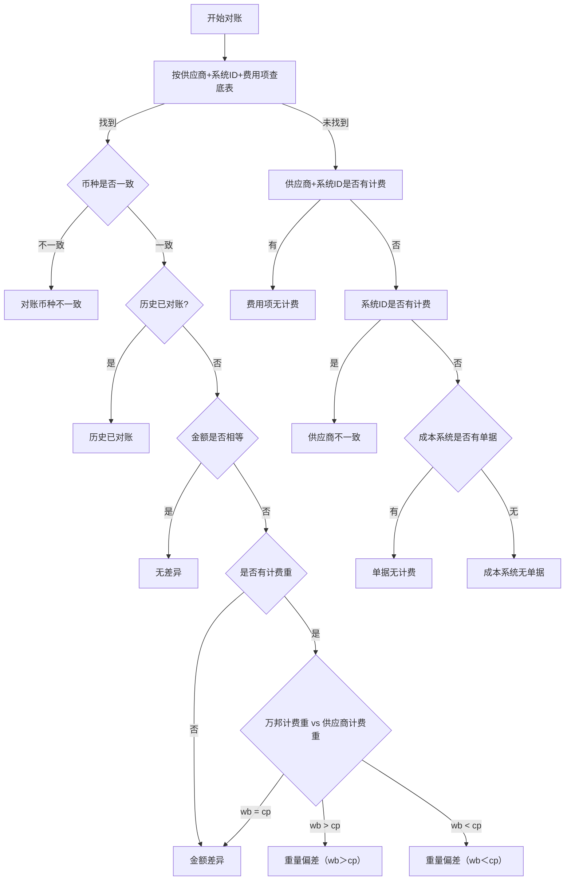

# 差异类型系统判断逻辑

## 一、差异类型总览

| 差异类型          | 判断逻辑                                                                                                   | 处理维度    | 适用账单类型     |
| :---------------- | :--------------------------------------------------------------------------------------------------------- | :---------- | :--------------- |
| 对账币种不一致    | 按`供应商编码+系统ID+费用项`在底表找到记录，但币种与账单币种不一致（此时快照计算金额为空）                 | 单据+费用项 | 全部             |
| 历史已对账        | 按`供应商编码+系统ID+费用项`在底表找到记录且币种一致，该记录已被**其他对账单ID**关联（明细状态非空且≠已完成） | 单据+费用项 | 全部             |
| 无差异            | 币种一致且未被占用，快照计算金额=账单金额                                                                  | 单据+费用项 | 全部             |
| 金额差异          | 币种一致且未被占用，快照计算金额≠账单金额，且无计费重或计费重相等                                          | 单据+费用项 | 全部             |
| 重量偏差（wb＞cp）| 币种一致且未被占用，快照计算金额≠账单金额，有计费重且万邦计费重 > 供应商计费重                             | 单据+费用项 | 尾程（有计费重） |
| 重量偏差（wb＜cp）| 币种一致且未被占用，快照计算金额≠账单金额，有计费重且万邦计费重 < 供应商计费重                             | 单据+费用项 | 尾程（有计费重） |
| 费用项无计费      | 按`供应商编码+系统ID+费用项`在底表未找到记录，但按`供应商编码+系统ID`不限费用项查询有`最新计算金额`非空记录 | 单据+费用项 | 全部             |
| 供应商不一致      | 按`供应商编码+系统ID`查询无`最新计算金额`非空记录，但按`系统ID`不限供应商查询有`最新计算金额`非空记录       | 单据+费用项 | 全部             |
| 单据无计费        | 按`系统ID`不限供应商查询无`最新计算金额`非空记录，且成本系统存在单据（查运单表/包裹表确认）               | 单据        | 全部             |
| 成本系统无单据    | 按`系统ID`不限供应商查询无`最新计算金额`非空记录，且成本系统不存在单据（运单账单查运单表，尾程账单查包裹表） | 单据        | 全部             |
| 清账              | 清账单流程自动写入，非系统判定（详见清账单流程）                                                           | 单据+费用项 | 全部             |

> **清账的特殊性**：清账为特殊对账流程的标识值，由清账单流程自动写入底表，不走本文件的差异判定流程。常规10种差异类型由系统在开始对账/重新对比时按判定逻辑自动判定；清账差异类型仅在清账单完成对账时固定写入，与判定逻辑无关。

---

## 二、差异判断流程

> **触发时机**：差异判定在「开始对账」（截取快照计算金额后）逐条执行；「重新对比」「刷新快照」时重新截取快照并重跑判定，但仅对**结算策略为空且未作废**的底表记录重跑，已确认结算策略的记录不在重新对比范围。

> **判定要点**：
>
> - **并行诊断思路**：差异判定采用"底表匹配优先，未匹配则分层排查根因"。先按`供应商编码+系统ID+费用项`查找底表记录，匹配到则进入金额对比主流程；未匹配到则按"供应商+系统ID→系统ID→成本系统单据"三层逐级缩小排查范围，精准定位缺失原因。
> - **查找键变化**：底表查找键为`供应商编码+系统ID+费用项`（3字段，不含币种）。币种从查找条件中移出，改为"找到记录后再判断币种一致性"的分支条件——币种不一致则判定为对账币种不一致，不再进入金额比对。
> - **两套金额口径分工**：金额比对（无差异/金额差异/重量差异）统一使用**快照计算金额**（开始对账/重新对比时截取固化，底表独立字段）；是否有计费的排查使用**最新计算金额**（持续同步单据表最新成本，底表独立字段）。
> - **三层排查逻辑**（未找到底表记录时）：
>   - 第一层：按`供应商编码+系统ID`不限费用项查询，有`最新计算金额`非空记录→**费用项无计费**（同供应商同单号有其他费用项计费，但缺本费用项）
>   - 第二层：按`系统ID`不限供应商查询，有`最新计算金额`非空记录→**供应商不一致**（该单号有成本但归属其他供应商）
>   - 第三层：成本系统是否有单据（运单账单查运单表、尾程账单查包裹表），有→**单据无计费**；无→**成本系统无单据**
> - **有计费的判定口径**：存在`最新计算金额`有值的记录（含0，不含空值）即视为有计费。
> - **快照计算金额取数前提**：底表记录直接承载账单数据，从底表记录取对应值（非实时查询成本系统）；按`供应商编码+系统ID+费用项`在底表匹配不到时，由账单触发在底表创建对应记录，再从该记录取快照值。
> - **快照计算金额取值规则**：快照即直接截取最新计算金额，最新计算金额为空则快照为空（null），不在截取时置换为 0；0 的置换在统计环节进行。币种不一致时快照为空，仅当币种一致且有值时快照才有值并参与金额比对。
> - **有计费重**：计费重取自账单/运单详情参数，非底表快照字段。

---

## 三、边界场景判断补充规则

| 边界场景                                                                | 判断规则                                                                                                                                                                   | 差异类型结果                                                                                       | 备注                                                                                             |
| :---------------------------------------------------------------------- | :------------------------------------------------------------------------------------------------------------------------------------------------------------------------- | :------------------------------------------------------------------------------------------------- | :----------------------------------------------------------------------------------------------- |
| 有计费记录但金额=0                                                      | 按「是否存在该费项/单据的最新计算金额记录」判断，不是按「金额是否=0」判断；有最新计算金额=0 的记录属于有成本，不算无计费                                                   | 继续走金额对比流程（账单金额=0则无差异；账单金额>0则按是否有计费重进一步判定为金额差异或重量差异） |                                                                                                  |
| 底表有该`供应商编码+系统ID+费用项`的记录，但币种与账单币种不一致       | 按`供应商编码+系统ID+费用项`找到记录后比对币种，即使只有一条记录，只要币种和账单不一致，就判定为币种不一致；因币种不匹配无法截取最新计算金额，快照计算金额为空，不做金额比对 | 对账币种不一致                                                                                     | 避免跨币种直接比金额导致的误导                                                                   |
| 底表有该`供应商编码+系统ID+费用项`的多条不同币种记录，但无任一与账单币种一致 | 按`供应商编码+系统ID+费用项`找到多条记录，按账单币种匹配不到对应币种记录即判定为对账币种不一致；无匹配币种无法截取最新计算金额，快照计算金额为空                         | 对账币种不一致                                                                                     |                                                                                                  |
| 追加账单占用同维度（该`供应商编码+系统ID+费用项`已被其他账单关联） | 该`供应商编码+系统ID+费用项`维度已存在被其他账单关联的记录（即维度下无对账单ID为空的记录），新增记录并标记为历史已对账；流程在「历史已对账?」节点出口，不进入金额比对 | 历史已对账                                                                                         | 计算成本只被对一次；快照为空仅作记录，不参与比对。财务据此人工决策追加费用是否应付               |
| 底表无该`供应商编码+系统ID+费用项`记录，但`系统ID`下有其他供应商的计费记录 | 按`供应商编码+系统ID+费用项`未找到记录，按`供应商编码+系统ID`查询无计费，但按`系统ID`不限供应商查询有`最新计算金额`非空记录 | 供应商不一致                                                                                       | 该单号在系统中有成本但归属其他供应商，本对账单供应商与之不匹配                                   |
