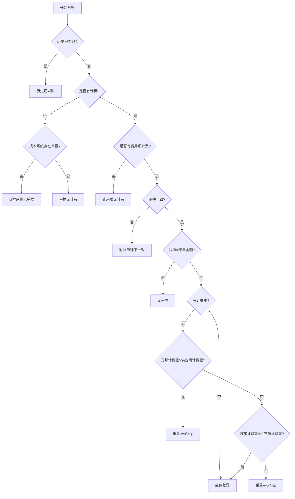

# 差异类型系统判断逻辑

## 一、差异类型总览

| 差异类型       | 判断逻辑                                                                                        | 处理维度    | 适用账单类型     |
| :------------- | :---------------------------------------------------------------------------------------------- | :---------- | :--------------- |
| 历史已对账     | 该`系统ID+费用项+币种`在对账明细底表查询到记录且已被**其他对账单ID**关联（状态=已锁定或已完成） | 单据+费用项 | 全部             |
| 成本系统无单据 | 运单账单用系统ID在运单表找；尾程账单用系统ID在包裹表找。若查询不到则无单据                      | 单据        | 全部             |
| 单据无计费     | 系统ID在成本系统查不到记录，或最新计算成本字段（即最新计算金额）为空（无值）                    | 单据        | 全部             |
| 费用项无计费   | 系统ID+费用项在成本系统查不到记录，或最新计算成本字段（即最新计算金额）为空（无值）             | 单据+费用项 | 全部             |
| 对账币种不一致 | 按账单币种匹配最新计算金额币种，匹配不到即判定为对账币种不一致（此时快照计算金额为空）          | 单据+费用项 | 全部             |
| 无差异         | 快照计算金额=账单金额                                                                           | 单据+费用项 | 全部             |
| 金额差异       | 币种一致的前提下，快照计算金额 ≠ 账单金额，且无计费重或计费重相等                               | 单据+费用项 | 全部             |
| 重量-wb＞cp    | 万邦计费重 > 供应商计费重                                                                       | 单据+费用项 | 尾程（有计费重） |
| 重量-wb＜cp    | 万邦计费重 < 供应商计费重                                                                       | 单据+费用项 | 尾程（有计费重） |

---

## 二、差异判断流程

> **触发时机**：差异判定在「开始对账」（截取快照计算金额后）逐条执行；「重新对比」「刷新快照」时重新截取快照并重跑判定，但仅对**结算策略为空且未作废**的明细重跑，已确认结算策略的明细不在重新对比范围。

> **判定要点**：
>
> - 两套金额口径分工：金额比对（无差异/金额差异/重量差异）统一使用**快照计算金额**（开始对账/重新对比时截取固化，底表独立字段）；是否有计费/是否有费用项计费使用**最新计算金额**（持续同步单据表最新成本，底表独立字段）。
> - 是否有计费 / 是否有费用项计费：依据**最新计算金额**，按系统ID（或系统ID+费用项）在成本系统查到记录且最新计算成本字段（即最新计算金额）有值（非null、含=0）才视为有计费；查不到记录或字段为空则判定无计费。
> - 快照计算金额取数前提：对账明细须关联底表数据，从关联底表取对应值（非实时查询成本系统）；按`系统ID+费用项+币种`在底表匹配不到时，由账单触发在底表创建对应记录，再从该记录取快照值。
> - 成本系统存在单据：运单账单查运单表、尾程账单查包裹表。
> - 快照计算金额取值规则：快照即直接截取最新计算金额，最新计算金额为空则快照为空（null），不在截取时置换为 0；0 的置换在统计环节进行。故对账差异场景下，币种不一致或最新为空时快照即表现为空，仅当币种一致且最新有值时快照才有值并参与金额比对。
> - 有计费重：计费重取自账单/运单详情参数，非底表快照字段。

---

## 三、边界场景判断补充规则

| 边界场景                                                     | 判断规则                                                                                                                                                        | 差异类型结果                                                                                       | 备注                                                                                             |
| :----------------------------------------------------------- | :-------------------------------------------------------------------------------------------------------------------------------------------------------------- | :------------------------------------------------------------------------------------------------- | :----------------------------------------------------------------------------------------------- |
| 有计费记录但金额=0                                           | 按「是否存在该费项/单据的最新计算成本记录」判断，不是按「金额是否=0」判断；有最新计算金额=0 的记录属于有成本，不算无计费                                        | 继续走金额对比流程（账单金额=0则无差异；账单金额>0则按是否有计费重进一步判定为金额差异或重量差异） |                                                                                                  |
| 只有一个计算币种但与账单元币种不一致                         | 即使只有一条计算币种记录，只要币种和账单不一致，就判定为币种不一致；因币种不匹配无法截取最新计算金额，快照计算金额为空，仅因币种不一致不做金额比对              | 对账币种不一致                                                                                     | 避免跨币种直接比金额导致的误导                                                                   |
| 有多个计算币种且没有与账单匹配的                             | 按账单币种匹配不到对应计算币种即判定为对账币种不一致；无匹配币种无法截取最新计算金额，快照计算金额为空                                                          | 对账币种不一致                                                                                     |                                                                                                  |
| 追加账单占用同维度（该`系统ID+费用项+币种`已被其他账单关联） | 该`系统ID+费用项+币种`维度已存在被其他账单关联的记录（即维度下无对账单ID为空的记录），新增记录并标记为历史已对账；流程在「历史已对账?」节点出口，不进入金额比对 | 历史已对账                                                                                         | 计算成本只被对一次；快照为空仅作记录，不参与比对。财务据此人工决策追加费用是否应付               |
| 关联账单取消对账后触发计算成本归位合并                       | 原承载记录解锁后，系统自动将游离的最新计算金额归位到已锁定的追加记录，重新截取快照并重跑差异判定，明细打变更标记                                                | 按归位后快照重新判定                                                                               | 对账中阶段可手动重新对比复核变更（仅对结算策略为空且未作废的明细重跑，已确认结算策略的明细跳过） |
