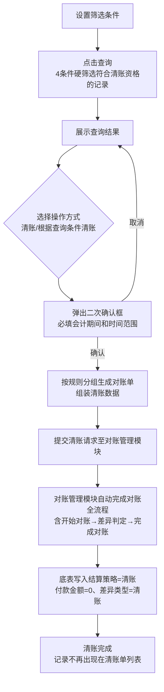

# 清账单列表

## 一、功能概述

### 1.1 业务背景

清账功能用于处理对账明细底表中**超过半年未结算**的记录，**一键完成清账全流程：生成账单→自动对账→自动完成对账**，最终底表写入结算策略=清账、付款金额=0、差异类型=清账，形成完整业务闭环。

**清账对象须同时满足以下条件**：

1. `对账单ID`为空
2. `最新计算金额`非空（含值为0）
3. 单据时间距今 ≥ 180天

---

## 二、页面布局

### 2.1 筛选条件

> **【页面级提示条（常驻展示给用户）】**
>
> - **位置**：页面顶部（筛选条件区域下方，列表区域上方）
> - **样式**：info 级信息提示框（带图标，常驻显示，不提供关闭按钮）
> - **文案**：「本页面仅展示**满足清账资格**的记录，须同时符合 3 个条件：① `对账单ID` 为空；② `最新计算金额` 非空（含值为0）；③ 单据时间距今 ≥ 180 天。」

| 字段名称   | 类型               | 必填性 | 说明                                                                                                                                                     |
| :--------- | :----------------- | :----- | :------------------------------------------------------------------------------------------------------------------------------------------------------- |
| 供应商 | 多选下拉（复选）   | 否     | 按供应商筛选，支持多选并集；取值来源：对账明细底表 `供应商编码/名称` 字段                                                                        |
| 账单类型   | 多选下拉（复选）   | 否     | 按账单类型筛选，支持多选并集；取值来源：对账明细底表 `账单类型` 字段（枚举：国内转运 / 内地空运 / 香港空运 / 空运卡转 / 国外清关 / 国外转运 / 尾程派送） |
| 系统ID     | 输入框（支持批量） | 否     | 支持批量输入多个系统ID（运单号/处理号），用逗号、空格或换行分隔，自动去重，支持批量粘贴                                                                  |
| 费用项     | 多选下拉（复选）   | 否     | 按费用项筛选，支持多选并集                                                                                                                               |
| 币种       | 多选下拉（复选）   | 否     | 按币种筛选，支持多选并集                                                                                                                                 |
| 单据时间   | 日期范围选择       | 否     | **默认起止日期：距今 365 天前 ~ 距今 180 天前（闭区间，含起止日期）**，优先展示已满足清账时间条件（距今 ≥ 180天）且相对较近的记录                        |

### 2.2 操作按钮

| 按钮名称         | 功能说明                                                         | 前置条件            | 权限控制                                                                                               |
| :--------------- | :--------------------------------------------------------------- | :------------------ | :----------------------------------------------------------------------------------------------------- |
| 查询             | 根据筛选条件查询列表数据                                         | 无                  | 拥有页面访问权限即可                                                                                   |
| 重置             | 清空所有筛选条件                                                 | 无                  | 拥有页面访问权限即可                                                                                   |
| 清账             | 对**用户勾选的记录**批量清账（一键完成全流程）                   | 勾选至少 1 条记录   | **按钮级独立权限**：清账操作权限（仅指定角色可操作，如财务主管、应付会计）                             |
| 根据查询条件清账 | 对**当前筛选条件下全部符合条件的记录**批量清账（一键完成全流程） | 当前查询结果 ≥ 1 条 | **按钮级独立权限**：根据查询条件清账权限（仅指定角色可操作，如财务主管、应付会计），与上方权限独立控制 |
| 导出             | 导出当前列表数据                                                 | 无                  | **按钮级权限**：仅指定角色可操作（如财务主管、应付会计）                                               |

#### 交互说明

##### 通用规则（两个按钮一致）

点击任一清账按钮均弹出二次确认框，共同包含以下内容：

1. 按「供应商 + 币种 + 账单类型」分组情况：共多少个唯一组合（即最终生成多少张账单）
2. 按币种分列的**最新计算金额合计**：每个币种多少条记录、合计金额多少（不跨币种折算加总）
3. **会计期间**（必填）：月份选择框，默认当前系统时间所在月份，允许手动修改；**本次提交的所有清账账单共用同一会计期间**；未选择时禁止提交
4. **账单时间范围**（必填）：日期范围选择框，默认取本次提交记录中最早~最晚的单据时间，允许手动修改起止日期；**本次提交的所有清账账单共用同一账单时间范围**
5. 提交成功后：按供应商+币种+账单类型分组生成对账单，**提交清账请求至对账管理模块**，对账管理模块自动完成对账全流程（含开始对账、差异判定、完成对账），最终底表写入结算策略=清账、付款金额=0、差异类型=清账；记录因不满足清账单列表页面查询条件（`对账单ID` 非空），后续查询时不再出现在清账单列表页面
6. **提交成功提示弹窗**：清账完成后，弹出成功提示框，内容为：「**清账已完成！本次共处理 X 张清账账单，涉及 Y 条记录。**」（X = 本批「供应商 + 币种 + 账单类型」唯一组合数量；Y = 本批处理的记录总条数）

---

##### 两个按钮差异对比

| 差异维度 | 清账（勾选版）                                                                                             | 根据查询条件清账（全量版）                                                                                         |
| :------- | :--------------------------------------------------------------------------------------------------------- | :----------------------------------------------------------------------------------------------------------------- |
| 处理范围 | 用户手动勾选的记录子集                                                                                     | 当前筛选条件下的全部查询结果                                                                                       |
| 前置条件 | 勾选至少 1 条记录                                                                                          | 当前查询结果 ≥ 1 条记录                                                                                            |
| 数量展示 | 勾选记录总条数                                                                                             | 当前查询结果总条数                                                                                                 |
| 警告文案 | 「确认对勾选记录执行清账？清账将自动完成全流程对账，生成清账账单并锁定底表记录，此操作不可逆，请谨慎操作」 | 「确认对当前查询结果全部执行清账？清账将自动完成全流程对账，生成清账账单并锁定底表记录，此操作不可逆，请谨慎操作」 |

### 2.3 列表字段（全部取自对账明细底表）

| 字段名称     | 说明                                                                       |
| :----------- | :------------------------------------------------------------------------- |
| 复选框       | 表头支持全选/取消全选；行级单条勾选，用于「清账」按钮操作                  |
| 系统ID       | 运单号 / 处理号                                                            |
| 供应商   | 系统计算成本时关联的供应商（即对账明细底表「供应商」字段）             |
| 账单类型     | 业务归属的成本环节（取自对账明细底表「账单类型」字段）                     |
| 费用项       | 费用项                                                                     |
| 币种         | 金额币种                                                                   |
| 单据时间     | 运单优先取发运时间，为空则取创建时间；订单优先取出库时间，为空则取创建时间 |
| 最新计算金额 | 系统最新计算金额                                                           |

---

## 三、处理流程

### 3.1 流程图

### 3.2 操作步骤

#### 前置操作差异（两种方式二选一）

| 差异维度 | 方式一：清账（勾选版·精准处理）            | 方式二：根据查询条件清账（全量版·批量处理）        |
| :------- | :----------------------------------------- | :------------------------------------------------- |
| 操作准备 | 筛选查询后，手动勾选需要清账的部分记录     | 筛选查询后，确认当前查询结果全部需要清账，无需勾选 |
| 点击按钮 | 「清账」                                   | 「根据查询条件清账」                               |
| 适用场景 | 小范围、精准指定的记录（如审批通过的部分） | 大范围、整批处理的记录                             |

---

#### 后续通用步骤（两种方式完全一致）

| 步骤 | 操作                         | 说明                                                                                                                                                                                |
| :--- | :--------------------------- | :---------------------------------------------------------------------------------------------------------------------------------------------------------------------------------- |
| 1    | 填写会计期间和时间范围       | 弹窗内确认处理范围条数、分组数、按币种最新计算金额合计；**选择会计期间（默认当前月份，可修改，必填）**；**选择账单时间范围（默认取最早~最晚单据时间，可修改，必填）**；点击确认提交 |
| 2    | 分组生成对账单并提交清账请求 | 按供应商+币种+账单类型分组生成对账单，明细按系统ID/费用项/最新计算金额展开；**本次提交的所有清账账单共用同一会计期间和账单时间范围**；**整体作为清账请求提交至对账管理模块**        |
| 3    | 对账管理模块自动完成对账         | 对账管理模块自动执行：生成账单→开始对账（写入对账单ID、快照计算金额）→差异判定（差异类型=清账）→完成对账（写入结算策略=清账、付款金额=0、锁定状态=已完成）                              |
| 4    | 清账完成                     | 底表记录已完成全流程对账，因 `对账单ID` 非空，后续查询时不再出现在清账单列表页面                                                                                                    |

### 3.3 清账生成对账单规则

#### 分组生成对账单规则

按 **「供应商编码 + 币种 + 账单类型」唯一组合** 分组生成对账单，每个唯一组合生成一张独立对账单。不可跨供应商、不可跨币种、不可跨账单类型合并。

> 同一供应商同币种同账单类型账单内允许正负金额记录共存（如实收/理赔冲抵），因明细行粒度已按「系统ID + 费用项 + 最新计算金额」一一展开，可与对账明细底表对应记录精确对齐，无需额外生成对账单。
>
> **两个操作按钮的处理范围说明**：「清账（勾选版）」仅处理用户勾选的记录子集；「根据查询条件清账（全量版）」处理当前筛选条件下的全部查询结果。**除处理范围不同外，两个按钮的分组生成对账单、字段取值逻辑完全一致**。

---

#### 清账请求字段与取值

（用户点击任意一个清账按钮时，按以下字段取值组装清账请求并提交至对账管理模块；对账管理模块收到请求后自动完成全流程对账）

| 生成维度                    | 取值规则                                                                                                                                             |
| :-------------------------- | :--------------------------------------------------------------------------------------------------------------------------------------------------- |
| **供应商（编码/名称）** | 取对账明细底表 `供应商编码`、`供应商名称` 字段                                                                                               |
| **账单类型**                | 取对账明细底表 `账单类型` 字段；同一清账账单内账单类型唯一（由「供应商+币种+账单类型」分组生成对账单保证）                                       |
| **账单明细行（每行一条）**  | 按「**系统ID + 费用项 + 最新计算金额**」展开，**最新计算金额取用户点击清账按钮时底表记录的实时值**，作为账单金额提交；一条清账记录对应账单一条明细行 |
| **会计期间**                | 取弹窗中用户选择的月份（必填，默认当前月，可修改）；**本次提交的所有清账账单共用**                                                                   |
| **账单时间范围**            | 取弹窗中用户选择的日期范围（必填，默认取本次提交记录中最早~最晚的单据时间，可修改）；**本次提交的所有清账账单共用**                                  |

> 清账请求提交至对账管理模块后，对账管理模块自动执行以下操作：
>
> 1. 生成清账账单（账单号、账单明细等）
> 2. 自动开始对账：写入对账单ID、对账单明细ID、账单金额（=清账请求中的最新计算金额）、锁定状态=已锁定，截取快照计算金额（=开始对账时底表当前的最新计算金额）
> 3. 自动差异判定：差异类型确定为「清账」（完成对账时写入底表）
> 4. 自动完成对账：写入差异类型=清账、结算策略=清账、付款金额=0、完成对账时间（系统时间）、锁定状态=已完成
> 5. 自动生成账单管理记录：完成对账后按主流程规则自动生成（1:1），各费用项金额取付款金额（清账记录为0）
>
> **清账特殊说明**：
>
> - 快照计算金额（开始对账时截取）与账单金额（清账请求提交时的值）可能因时间差导致不一致，但**不影响清账结果**
> - 清账为特殊对账流程：差异类型固定为「清账」，付款金额固定为0，不按常规差异判定逻辑处理
> - 清账为系统自动全流程，不执行标准完成对账前置校验（结算策略在完成对账时由系统自动写入，无需人工预绑定）
>
> 以上步骤均在对账管理模块事务内自动完成，清账模块无需额外干预。

---

## 四、注意事项

1. **模块职责边界**：本模块负责「查询符合清账条件的记录 → 用户选择操作方式 → 填写会计期间和账单时间范围（本次提交所有账单共用）→ 按供应商+币种+账单类型分组生成对账单 → 组装清账数据 → 提交清账请求至对账管理模块」。**清账全流程（含生成账单、自动对账、完成对账等）由对账管理模块自动执行**，本模块不再另行规定。
2. **清账不可逆**：清账账单一经生成即完成全流程对账，**不可删除、不可撤销**。如需调整已清账记录，请通过其他业务流程处理。
3. **数据一致性**：清账操作在同一事务内完成，确保底表状态（对账单ID、结算策略、差异类型、锁定状态等）与账单状态一致。**事务失败时全部回滚**——已生成的对账单删除、底表已写入的字段（对账单ID、锁定状态、快照计算金额等）恢复为清账前的未锁定状态，用户可重新提交清账请求。
4. **成本变更影响**：清账完成后，对账明细底表的最新计算金额仍可随单据更新实时变化（底表PRD第三节明确「无论是否锁定都更新」），但**不影响已完成清账的结算策略和付款金额**。
